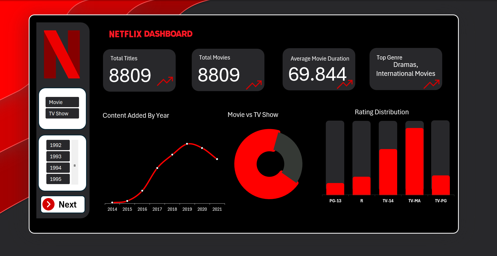
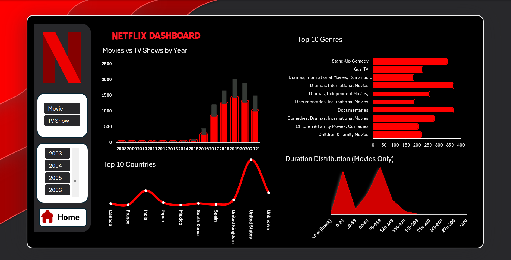

# 🎬 Netflix Data Analysis Dashboard (Excel)

## 📌 Project Overview
This project presents an interactive Netflix dashboard built using Microsoft Excel. It provides insights into content distribution, trends, and viewing patterns across different categories.

---

## 🔧 Tools & Technologies
- Microsoft Excel  
- Pivot Tables  
- Charts & Data Visualization  
- Excel Data Cleaning  

---

## 🧹 Data Preparation
- Cleaned raw dataset using Excel (handled missing values and removed inconsistencies)  
- Created new calculated columns for better analysis  
- Structured data for dashboard visualization  
- Used Excel features for data transformation and preparation  

---

## 📊 Dashboard Features

### 📍 Page 1: Overview
- Total Movies and TV Shows  
- Year-wise content trends  
- Top Genre  
- Rating Distribution  

### 📍 Page 2: Content Analysis
- Movies and Tv Shows distribution by Year  
- Ratings classification  
- Duration Distribution  
- Interactive filtering using slicers  

---

## 📷 Dashboard Preview

### 🔹 Page 1

### 🔹 Page 2

---

## 🚀 How to Use
1. Download the Excel file from the `dashboard` folder  
2. Open using Microsoft Excel  
3. Use slicers and filters to explore the dashboard  

---

## 📁 Project Structure

netflix-excel-dashboard/
│
├── data/
├── dashboard/
├── images/
└── README.md

## 📈 Key Insights
- Majority of content consists of Movies compared to TV Shows  
- Content production increased significantly after 2015  
- Certain countries dominate Netflix content availability  
- Drama and Comedy are the most common genres  

---

## 🔗 GitHub Repository
https://github.com/yourusername/netflix-excel-dashboard

---

## 👤 Author
**A Afran**
